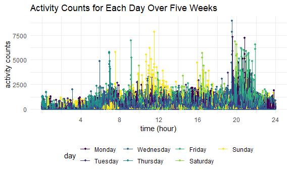
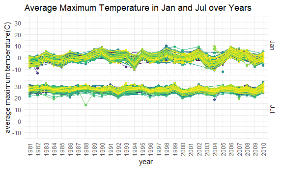
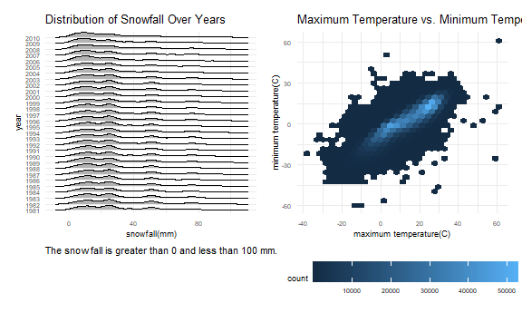

Homework 3
================
Ying Jin
2020/10/6

``` r
library(tidyverse)
```

    ## -- Attaching packages -------------------------------------- tidyverse 1.3.0 --

    ## √ ggplot2 3.3.2     √ purrr   0.3.4
    ## √ tibble  3.0.3     √ dplyr   1.0.2
    ## √ tidyr   1.1.2     √ stringr 1.4.0
    ## √ readr   1.3.1     √ forcats 0.5.0

    ## -- Conflicts ----------------------------------------- tidyverse_conflicts() --
    ## x dplyr::filter() masks stats::filter()
    ## x dplyr::lag()    masks stats::lag()

``` r
library(p8105.datasets)
library(patchwork)
library(ggridges)
library(hexbin)

knitr::opts_chunk$set(
  fig.width = 6,
  fig.asp = .6,
  out.width = "90%"
)

theme_set(theme_minimal() + theme(legend.position = "bottom"))

options(
  ggplot2.continuous.colour = "viridis",
  ggplot_cpntinuous.fill = "viridis"
)

scale_colour_discrete = scale_color_viridis_d
scale_fill_discrete = scale_fill_viridis_d
```

## Problem 1

Load the dataset

``` r
data("instacart")
```

This dataset contains 1384617 rows and 15 columns.

Observations are the level of items in orders by user. There are user/
order variables – user ID, order ID, order day and order hour. There are
also item variables – name, aisle, department, and some numeric codes.

How many aisles, and which are most products from?

``` r
instacart %>% 
  count(aisle) %>%
  nrow()
```

    ## [1] 134

``` r
instacart %>% 
  count(aisle) %>%
  arrange(desc(n))
```

    ## # A tibble: 134 x 2
    ##    aisle                              n
    ##    <chr>                          <int>
    ##  1 fresh vegetables              150609
    ##  2 fresh fruits                  150473
    ##  3 packaged vegetables fruits     78493
    ##  4 yogurt                         55240
    ##  5 packaged cheese                41699
    ##  6 water seltzer sparkling water  36617
    ##  7 milk                           32644
    ##  8 chips pretzels                 31269
    ##  9 soy lactosefree                26240
    ## 10 bread                          23635
    ## # ... with 124 more rows

There are 134 aisles and most products come from fresh vegetables.

Let’s make a plot

``` r
instacart %>% 
  count(aisle) %>% 
  filter(n > 10000) %>% 
  mutate(
    aisle = factor(aisle),
    aisle = forcats::fct_reorder(aisle,n)
  ) %>% 
  ggplot(aes(x = aisle, y = n)) +
  geom_point() +
  theme(axis.text.x = element_text(angle = 90, vjust = .5,hjust = 1))
```


Three most popular items in three aisles

``` r
instacart %>% 
  filter(aisle %in% c("baking ingredients","dog food care","packaged vegetables fruits")) %>% 
  group_by(aisle) %>% 
  count(product_name) %>% 
  mutate(rank = min_rank(desc(n))) %>% 
  filter(rank < 4) %>% 
  arrange(aisle, rank) %>% 
  knitr::kable()
```

| aisle                      | product\_name                                 |    n | rank |
| :------------------------- | :-------------------------------------------- | ---: | ---: |
| baking ingredients         | Light Brown Sugar                             |  499 |    1 |
| baking ingredients         | Pure Baking Soda                              |  387 |    2 |
| baking ingredients         | Cane Sugar                                    |  336 |    3 |
| dog food care              | Snack Sticks Chicken & Rice Recipe Dog Treats |   30 |    1 |
| dog food care              | Organix Chicken & Brown Rice Recipe           |   28 |    2 |
| dog food care              | Small Dog Biscuits                            |   26 |    3 |
| packaged vegetables fruits | Organic Baby Spinach                          | 9784 |    1 |
| packaged vegetables fruits | Organic Raspberries                           | 5546 |    2 |
| packaged vegetables fruits | Organic Blueberries                           | 4966 |    3 |

Apples vs. Ice Cream

``` r
instacart %>% 
  filter(product_name %in% c("Pink Lady Apples","Coffee Ice Cream")) %>% 
  group_by(product_name,order_dow) %>% 
  summarise(
    mean_hour = mean(order_hour_of_day)
  ) %>% 
  pivot_wider(
    names_from = order_dow,
    values_from = mean_hour
  ) %>% 
  knitr::kable()
```

    ## `summarise()` regrouping output by 'product_name' (override with `.groups` argument)

| product\_name    |        0 |        1 |        2 |        3 |        4 |        5 |        6 |
| :--------------- | -------: | -------: | -------: | -------: | -------: | -------: | -------: |
| Coffee Ice Cream | 13.77419 | 14.31579 | 15.38095 | 15.31818 | 15.21739 | 12.26316 | 13.83333 |
| Pink Lady Apples | 13.44118 | 11.36000 | 11.70213 | 14.25000 | 11.55172 | 12.78431 | 11.93750 |

## Problem 2

First, load the accelerometer dataset and tidy it.

``` r
accel_df = read_csv("./data/accel_data.csv") %>% 
  janitor::clean_names() %>% 
  pivot_longer(
    cols = starts_with("activity_"),
    names_to = "minute",
    names_prefix = "activity_",
    values_to = "n_activ"
  ) %>% 
  mutate(
    weekday_vs_weekend = case_when(
      day %in% c("Monday","Tuesday","Wednesday","Thursday","Friday")~"weekday",
      day %in% c("Saturday","Sunday")~"weekend"
    ),
    day = factor(day),
    day = fct_relevel(day, c("Monday","Tuesday","Wednesday","Thursday","Friday","Saturday","Sunday")),
    minute = as.numeric(minute)
  )
```

The steps I took to wrangle the dataset include:

  - Clean the column names;

  - Change the dataset from wide format into long format;

  - Create a new column named `weekday_vs_weekend` to indicate whether a
    certain day is a weekday or a weekend;

  - Change the `day` variable into factor and relevel it;

  - Change the `minute` variable into numeric.

The resulting dataset contains information about everyday “activity
counts” of a 63 year-old male diagnosed with CHF for five weeks. The
intervals are usually one minute.

  - It contains 50400 rows and 6 variables.

  - The dataset provides five-week observations on “activity counts” of
    a man. The counting started at the midnight of each day with
    one-minute intervals. Also, information about the week which a
    certain day belongs to, day of the week and whether that day is a
    weekday or weekend is given.

Then I aggregate across minutes to create a total activity variable for
each day and create a table.

``` r
accel_df %>% 
  group_by(week, day) %>% 
  summarise(
    total_activ = sum(n_activ)
      ) %>% 
  pivot_wider(
    names_from = day,
    values_from = total_activ
  ) %>% 
  knitr::kable()
```

    ## `summarise()` regrouping output by 'week' (override with `.groups` argument)

| week |    Monday |  Tuesday | Wednesday | Thursday |   Friday | Saturday | Sunday |
| ---: | --------: | -------: | --------: | -------: | -------: | -------: | -----: |
|    1 |  78828.07 | 307094.2 |    340115 | 355923.6 | 480542.6 |   376254 | 631105 |
|    2 | 295431.00 | 423245.0 |    440962 | 474048.0 | 568839.0 |   607175 | 422018 |
|    3 | 685910.00 | 381507.0 |    468869 | 371230.0 | 467420.0 |   382928 | 467052 |
|    4 | 409450.00 | 319568.0 |    434460 | 340291.0 | 154049.0 |     1440 | 260617 |
|    5 | 389080.00 | 367824.0 |    445366 | 549658.0 | 620860.0 |     1440 | 138421 |

According to the resulting table, this man is less active on Monday and
active on the other days in the first two weeks. He is less active on
weekends, especially on Saturday, in the last two weeks.

Next I make a single-panel plot that shows the 24-hour activity time
courses for each day. To better indicate the time of a day, I change the
labels of x axis into hours.

``` r
accel_df %>% 
  ggplot(aes(x = minute, y = n_activ, color = day,group = week)) +
  scale_x_continuous(
    breaks = c(240,480,720,960,1200,1440),
    labels = c("4","8","12","16","20","24")
  ) +
  labs(
    title = "Activity Counts for Each Day Over Five Weeks",
    x = "time (hour)",
    y = "activity counts" 
  ) +
  geom_point(size = 1) +
  geom_line()
```



Based on the plot above, it can be seen that in general, the man is most
active at night (about 20 to 22 o’clock) and least active after 22
o’clock until the next day morning (about 6 o’clock). We can also see
that he is very active in the noon, about 11 to 12 o’clock, on Sunday.
Somtimes the man is very active at other time, like about 7:00 on
Thursday, 7:30 on Sunday, and 16:00 - 17:00 on Saturday and Sunday.

## Problem 3

Load NY NOAA dataset and count missing values in `tmin` and `tmax`.

``` r
data("ny_noaa")

n_na_tmin = ny_noaa %>% pull(tmin) %>% is.na() %>% sum()

n_na_tmax = ny_noaa %>% pull(tmax) %>% is.na() %>% sum()
```

We can see that:

  - This dataset provides information of total daily precipitation,
    snowfall, snow depth, maximum and minimum temperature for all New
    York state weather stations on each day from January 1, 1981 through
    December 31, 2010;

  - NY NOAA dataset contains 2595176 rows and 7 variables;

  - Key variables include weather station ID, date, snowfall, snow
    depth, maximum and minimum temperature;

  - There are missing values in `prcp`, `snow`, `snwd` and especially in
    `tmin` and `tmax`, in which missing values take about 43.713% and
    43.71% of total records respectively.

Then clean the dataset.

``` r
ny_noaa_df = 
  ny_noaa %>% 
  mutate(
    tmin = as.numeric(tmin),
    tmax = as.numeric(tmax),
    tmax = tmax/10,
    tmin = tmin/10
  ) %>% 
  separate(date,into = c("year","month","day"),sep = "-") %>% 
  mutate(
    month = as.numeric(month),
    month = month.abb[month],
    ) 
```

The cleaning steps include:

  - Convert `tmin` and `tmax` into number;

  - Change the units of `tmax` and `tmin` into degree C;

  - Create separate variables `year`, `month` and `day` from `date`;

  - Change the values of `month` into corresponding month abbreviation.

Then get the most frequently observed value for snowfall.

``` r
ny_noaa_df %>% 
  filter(!(is.na(snow))) %>% 
  group_by(snow) %>% 
  summarise(n_obs = n()) %>% 
  arrange(desc(n_obs))
```

    ## `summarise()` ungrouping output (override with `.groups` argument)

    ## # A tibble: 281 x 2
    ##     snow   n_obs
    ##    <int>   <int>
    ##  1     0 2008508
    ##  2    25   31022
    ##  3    13   23095
    ##  4    51   18274
    ##  5    76   10173
    ##  6     8    9962
    ##  7     5    9748
    ##  8    38    9197
    ##  9     3    8790
    ## 10   102    6552
    ## # ... with 271 more rows

It can be seen that the most common value of snowfall is 0 mm. That’s
because most of time there is no snowfall in NY state.

Next, I make plot of `year` vs average `tmax` oberved in differnt
stations in January and July separately.

``` r
ny_noaa_df %>% 
  filter(
    month %in% c("Jan","Jul"),
    !(is.na(tmax))
    ) %>% 
  group_by(id,year,month) %>% 
  summarise(
    mean_tmax = mean(tmax,na.rm = TRUE)
  ) %>% 
  ggplot(aes(x = year, y = mean_tmax, group = id, color = id)) +
  geom_point() +
  geom_line() +
  facet_grid(month~.) +
  labs(
    title = "Average Maximum Temperature in Jan and Jul over Years",
    x = "year",
    y = "average maximum temperature(C)"
  ) +
  theme(
    legend.position = "none",
    axis.text.x = element_text(angle = 90, vjust = .5,hjust = 1)
    )
```

    ## `summarise()` regrouping output by 'id', 'year' (override with `.groups` argument)



Below are interpretions of the plot:

  - Apparently, the average maximum temperature in July is always higher
    than January;

  - It can be noticed that the average maximum temperature in January is
    more variable than July;

  - In general, the maximum temperature of NY state in both January and
    July from 1981 to 2010 got warmer;

  - There are outliers of the average maximum temperature in both
    January and July. For example, in July, 1988, the average of maximum
    temperature recorded by one station is very low compared to others.
    And in January, 2005, there is also a very low average maximum
    temperature recorded by one station.

Then I make a plot showing `tmax` vs `tmin`.

``` r
tmax_plot = 
  ny_noaa_df %>% 
  filter(
    !(is.na(tmax)),
    !(is.na(tmin))
  ) %>% 
  ggplot(aes(x = tmax, y = tmin)) +
  geom_hex() +
  labs(
    title = "Maximum Temperature vs. Minimum Temperature",
    x = "maximum temperature(C)",
    y = "minimum temperature(C)"
  ) +
  theme(legend.key.width = unit(1.2, "cm"),
        plot.title = element_text(size = 10),
        text = element_text(size = 7)) 
```

At last, I make a plot showing the distribution of snowfall values
greater than 0 and less than 100 separately by year.

``` r
snow_plot = 
  ny_noaa_df %>% 
  filter(
   (snow > 0) & (snow < 100)
  ) %>% 
  ggplot(aes(x = snow, y = year)) +
  geom_density_ridges(scale = 0.85) +
  labs(
    title = "Distribution of Snowfall Over Years",
    x = "snowfall(mm)",
    caption = "The snowfall is greater than 0 and less than 100 mm."
  ) + 
  theme(plot.title = element_text(size = 10),
        plot.caption = element_text(hjust = 0,size = 8),
        text = element_text(size = 7))
```

In the end, I combine the two panels above together.

``` r
snow_plot + tmax_plot
```

    ## Picking joint bandwidth of 3.76



It can be seen that from 1981 to 2010, the amount of snowfall in NY
state decreased. Over this time period, the maximum temperature was
mainly between 0 \~ 30 degrees C, and the minumum temperature was mainly
between -5 \~ 20 degrees C.
